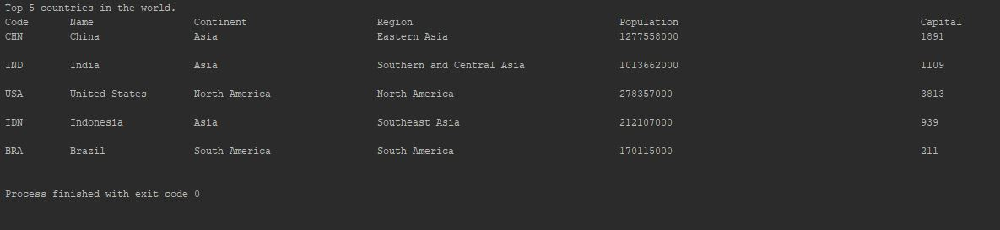
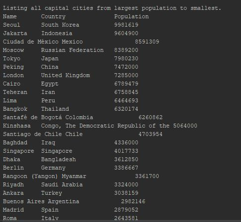

# Software Engineering Methods Coursework
## Group 7

- Master Branch Build Status: 
- Develop Branch Build Status: 
- 
- 

- Master Code Coverage: 
- Develop Code Coverage: 

## Requirements Met

> 29 of 32 requirements met, which is 90.6%

| ID | Name | Met | Screenshot |
|----|------|-----|------------|
| 1  |All the countries in the world organised by largest population to smallest.      | Yes    | |
| 2  |All the countries in a continent organised by largest population to smallest.      | Yes    |            |
| 3  |All the countries in a region organised by largest population to smallest.      | Yes    |            |
| 4  |The top N populated countries in the world where N is provided by the user.      | Yes    |            |
| 5  |The top N populated countries in a continent where N is provided by the user.      | Yes    |            |
| 6  |The top N populated countries in a region where N is provided by the user.      | Yes    |            |
| 7  |All the cities in the world organised by largest population to smallest.      | Yes    |            |
| 8  |All the cities in a continent organised by largest population to smallest.      | Yes    |            |
| 9  |All the cities in a region organised by largest population to smallest.      | Yes    |            |
| 10 |All the cities in a country organised by largest population to smallest.      | Yes    |            |
| 11 |All the cities in a district organised by largest population to smallest.      | Yes    |            |
| 12 |The top N populated cities in the world where N is provided by the user.      | Yes    |            |
| 13 |The top N populated cities in a continent where N is provided by the user.      | Yes    |            |
| 14 |The top N populated cities in a region where N is provided by the user.      | Yes    |            |
| 15 |The top N populated cities in a country where N is provided by the user.      |Yes     |            |
| 16 |The top N populated cities in a district where N is provided by the user.      |Yes     |            |
| 17 |All the capital cities in the world organised by largest population to smallest.      |Yes     |            |
| 18 |All the capital cities in a continent organised by largest population to smallest.      |Yes     |            |
| 19 |All the capital cities in a region organised by largest to smallest.      |Yes     |            |
| 20 |The top N populated capital cities in the world where N is provided by the user.      |Yes     |            |
| 21 |The top N populated capital cities in a continent where N is provided by the user.      |Yes     |            |
| 22 |The top N populated capital cities in a region where N is provided by the user.      |Yes     |            |
| 23 |The population of people, people living in cities, and people not living in cities in each continent.      |No     |            |
| 24 |The population of people, people living in cities, and people not living in cities in each region.      |No     |           |
| 25 |The population of people, people living in cities, and people not living in cities in each country.      |No     |            |
| 26 |Population of world      |Yes     |            |
| 27 |Population of continent      |Yes     |            |
| 28 |Population of region  |Yes     |            |
| 29 |Population of country     |Yes     |            |
| 30 |Population of district    |Yes     |            |
| 31 |Population of city   |Yes     |            |
| 32 |Number of people who speak Chinese, English, Hindi, Spanish and Arabic from greatest number to smallest, including the percentage of the world population.      |Yes     |            |

